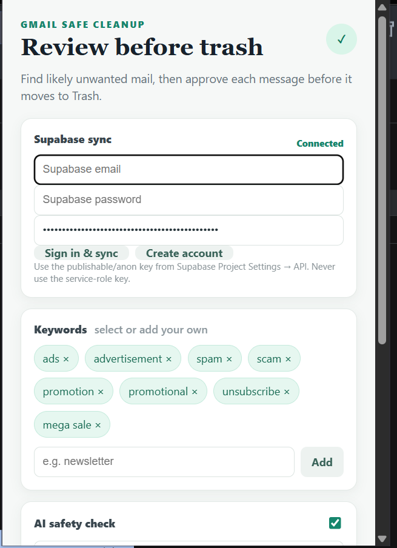

# Gmail Safe Cleanup 🎯

## Basic Details

### Team Name: USELESS LEARNES 

### Team Members

* Member 1: Amardeep k - CUSAT SOE 
* Member 2: Adnan A - CUSAT SOE

### Project Description

Gmail Safe Cleanup is a Manifest V3 Chrome extension that finds Gmail messages matching user-selected keywords. It uses Gemini or Grok as a second-pass AI safety check and moves only user-approved messages to Gmail Trash.

The extension is designed to make Gmail cleanup safer by keeping the user in control and never permanently deleting emails.

### The Problem (that doesn't exist)

You have 50,000 emails in Gmail, but somehow the one email you actually need is hiding between 4,999 promotional emails, spam messages, advertisements, and "UNSUBSCRIBE NOW!!!" emails. 😭

### The Solution (that nobody asked for)

Gmail Safe Cleanup searches for suspicious or unwanted emails using user-selected keywords, sends candidates through Gemini or Grok for an additional safety check, and lets the user manually approve messages before moving them to Trash.

No blind deletion. No accidental loss of important emails. Just controlled digital cleaning. 🧹📧

## Technical Details

### Technologies/Components Used

For Software:

* JavaScript
* Chrome Extension Manifest V3
* Gmail API
* Gemini API
* Grok / xAI API
* Supabase
* OAuth 2.0
* HTML/CSS
* Chrome Extensions API

For Hardware:

* No additional hardware required
* A computer with Google Chrome is required

### Implementation

For Software:

# Installation

1. Create a Google Cloud project.
2. Enable the Gmail API.
3. Create an OAuth 2.0 **Chrome Extension** client.
4. Configure the OAuth consent screen and add test users while the application is in testing.
5. Open Chrome and go to:

`chrome://extensions`

6. Enable **Developer mode**.
7. Select **Load unpacked**.
8. Select the project folder.
9. Open the extension popup.

# Run

1. Choose the keywords you want to search for.
2. Optionally enter a Gemini or Grok API key and model.
3. Click **Sign in & scan Gmail**.
4. Review the messages identified by the extension.
5. Select the messages you want to remove.
6. Confirm the action to move them to Gmail Trash.

The extension requests only the `https://www.googleapis.com/auth/gmail.modify` permission and uses Gmail search to find candidate messages.

## Project Documentation

For Software:

# Screenshots

 INTERFACE 1 
 INTERFACE 2

# Diagrams

*Workflow: User → Chrome Extension → Gmail API → Keyword Matching → Gemini/Grok Safety Check → User Review → Gmail Trash.*

## Supabase Sync

The extension includes Supabase email/password sign-in and synchronizes keyword settings.

Before using synchronization, run the complete migration located at:

`supabase/migrations/001_user_settings.sql`

The migration creates the `user_settings` table, row-level security policies, and the required permissions.

The stored settings include:

* User ID
* Keywords
* AI provider
* AI model
* Maximum results
* Updated timestamp

The extension uses Supabase Row Level Security so users can access and modify only their own settings.

For Supabase authentication, use the browser-safe publishable/anon key. **Never use the service-role/secret key in the extension.**

## AI Configuration

Gemini is the default AI provider, with `gemini-3.8-flash` as the default model. The model can be changed because model availability may vary.

Grok uses xAI's OpenAI-compatible `/v1/chat/completions` endpoint.

For a public release, shared AI API keys should not be included inside the extension. AI requests should be placed behind an authenticated server-side proxy or users should provide their own API keys.

## Safety

Keyword matching is used only to discover possible candidates.

The AI safety check treats terms such as `sponsor`, `promotion`, and `unsubscribe` as ambiguous. It can flag possible invoices, account notices, business requests, sponsorship inquiries, receipts, and personal emails for manual review.

If the AI fails, the extension falls back to manual review. **AI failure never authorizes deletion.**

The extension uses `users.messages.trash` only after the user selects and confirms messages. It never permanently deletes emails.

## Team Contributions

* AMARDEEP K: Chrome extension development, Gmail API and OAuth integration settings synchronization and UI
* ADNAN: Gemini/Grok AI safety-check integration and email classification Supabase authentication, 

Made with ❤️ at TinkerHub Useless Projects

